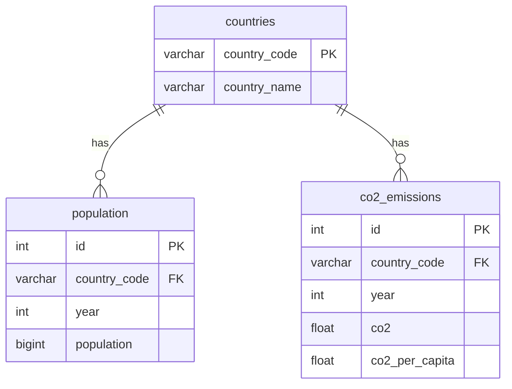

# Emissions & Population Analysis

A Python project that loads global population and CO2 emissions data into a MySQL database and generates visualizations comparing countries over time.

## Data Sources

- **Population data** — `population/population.csv` (World Bank)
- **CO2 emissions data** — `owid-co2-data.csv` ([Our World in Data](https://github.com/owid/co2-data))

## Database Schema



## Visualizations

Running `analyze.py` produces five charts:

- `population_chart.png` — Top 10 most populous countries (2021)
- `co2_chart.png` — Top 10 CO2 emitters per capita (2021)
- `growth_chart.png` — Population growth for China, India, and the USA since 1960
- `co2_growth_chart.png` — CO2 emissions over time for China, India, and the USA since 1960
- `scatter_chart.png` — Population vs total CO2 emissions by country (2021), with top 10 labeled

## Project Structure

```
EmissionsProject/
├── worldProject.sql      # SQL schema (countries, population, co2_emissions tables)
├── load_data.py           # Loads CSV data into MySQL
├── analyze.py             # Queries the database and generates charts
├── requirements.txt       # Python dependencies
├── owid-co2-data.csv      # CO2 emissions dataset
└── population/
    └── population.csv     # World Bank population dataset
```
